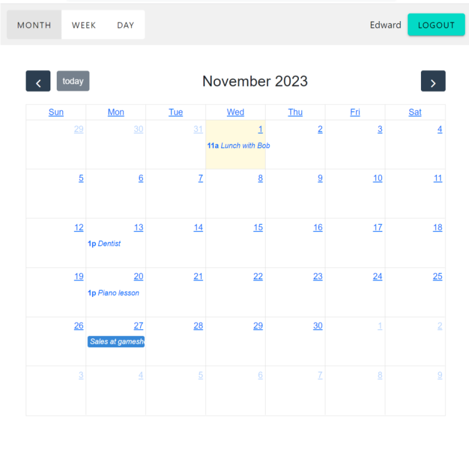
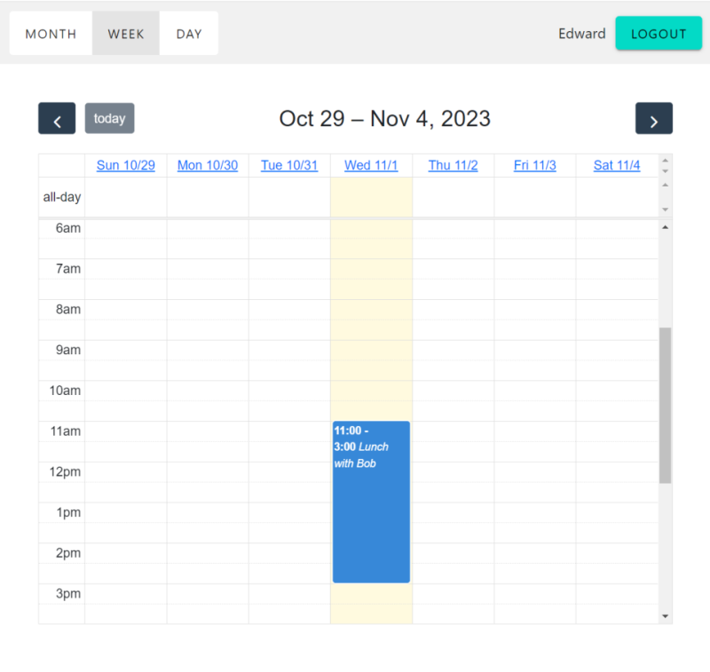
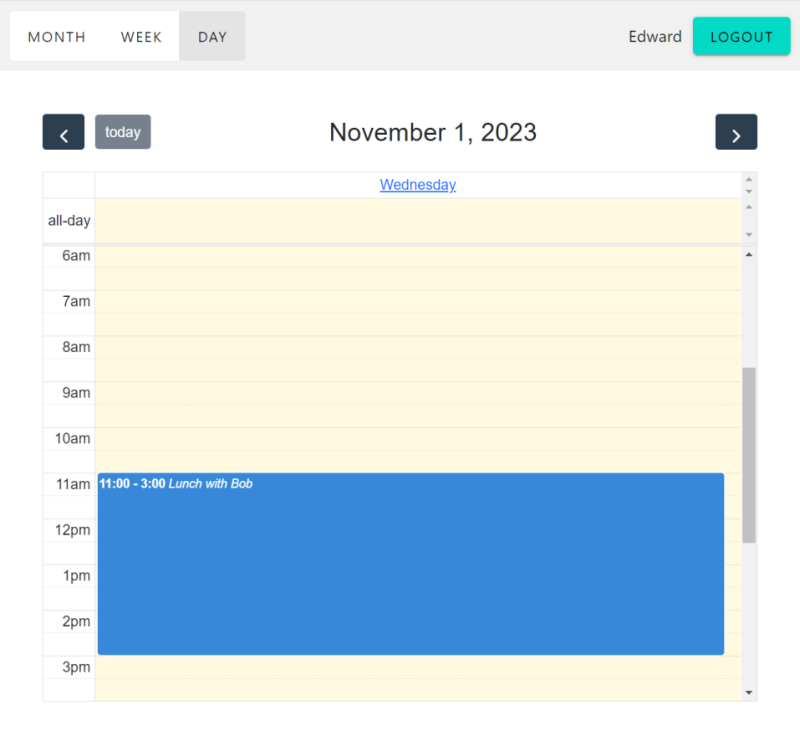
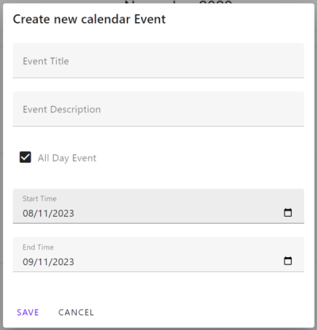
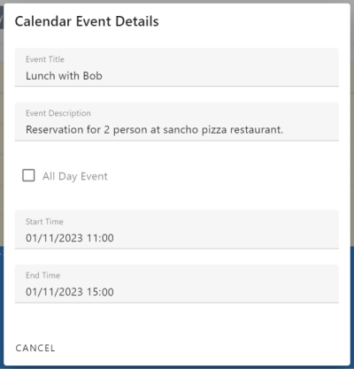

# Calendar App

## Table of Contents

- [The app](#the-app)
  - [Month View](#month-view)
  - [Week View](#week-view)
  - [Day View](#day-view)
  - [Create New Event](#create-new-event)
  - [Event Details](#event-details)
- [Documentation](#documentation)
- [Installation](#installation)
  - [Prerequisites](#prerequisites)
  - [Steps](#steps)
    - [Clone the Repository](#clone-the-repository)
    - [Open in Visual Studio](#open-in-visual-studio)
    - [Auto Dependency Installation](#auto-dependency-installation)
    - [Build the Solution](#build-the-solution)
    - [Run the Project](#run-the-project)
- [Questions or Issues?](#questions-or-issues)
- [Appendix](#appendix)
- [Authors](#authors)


# The app
> **Warning**
> This is a work in progress. Some features are still missing, and the UI seen in the screenshot is subject to change.

A simple, self-made calendar app crafted for personal enjoyment. It offers basic calendar and event functionalities, allowing you to manage your calendar and schedule events effortlessly without the complexities of mainstream alternatives.

- **Month View**: Get a broad perspective of your entire month. Ideal for longer-term planning.
  
  
- **Week View**: If a monthly schedule feels too overwhelming, why not consider weekly scheduling instead?
  
  
- **Day View**: Dive deep into your day's agenda.
  

- **Create New Event**: Start from scratch. Input your event details and create it.
  
  
  
- **Event Details**: Once an event is set, get all the information at a glance with a simple click.
  
  

## Documentation

> **Warning**
> Work in progress.

## Installation

Follow these steps to set up the project on your local machine:

### Prerequisites:

- **Visual Studio**: Ensure you have [Visual Studio](https://visualstudio.microsoft.com/) installed. The latest version is recommended.
  
- **.NET SDK**: Ensure you have the .NET SDK corresponding to the project's version installed. You can check the `.csproj` file for the target framework.

- **Node.js**: As this project uses Vue 3 for the frontend, you'll need [Node.js](https://nodejs.org/) installed. This will come with npm (Node package manager) which is used for managing frontend dependencies.

### Steps:

1. **Clone the Repository**:
   ```sh
   git clone <repository-url>
   cd <repository-name>
   ```

2. **Open in Visual Studio**:
  - Navigate to the location where you cloned the repository.
  - Double-click on the .sln file to open the solution in Visual Studio.
  
3. **Auto Dependency Installation**: 
   - By default, this project is set up to automatically restore .NET dependencies.
   - When you build the project for the first time, Visual Studio should handle .NET dependencies for you.
   - For frontend dependencies, navigate to the directory containing the `package.json` file (usually the root of the frontend project or `ClientApp` folder) and run:
     ```sh
     npm install
     ```

4. **Build the Solution**:
   - In Visual Studio, right-click on the Solution in Solution Explorer and select "Build Solution".

5. **Run the Project**:
   - Ensure the web project is set as the "Startup" and "Web" Projects.
   - Press `F5` or click on the "Start" button to run the project.
   - 

## Questions or Issues?
If you have any questions about the project or encounter any issues, please feel free to [post them here](https://github.com/ed-m-jp/Calendar/issues).


## Appendix

[Swagger Documentation](documents/swagger.json)

## Authors

* **Maire Edward**
